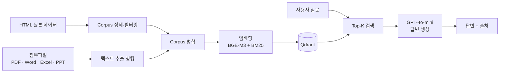

<p align="center">
  
</p>

<p align="center">
  
  
  
  
  
</p>

학교 홈페이지 문서와 첨부파일(PDF, Word, Excel, PPT)에 흩어진 학사·생활 정보를 검색해, **출처와 함께 답변하는 RAG 챗봇**입니다.

<br/>

## 📊 시스템 구성

| 항목 | 내용 |
| --- | --- |
| 데이터 | 16,106개 청크 (청크 1,000자, 오버랩 150자) |
| 임베딩 | BGE-M3 (1024차원) + BM25 sparse 벡터 |
| 벡터 DB | Qdrant |
| LLM | GPT-4o-mini (Ollama로 교체 가능) |
| 서빙 | Flask 웹 데모, CLI 데모 |
| 첨부파일 | `.pdf` `.docx` `.doc` `.xlsx` `.xls` `.pptx` `.ppt` `.txt` |

<br/>

## 🏗 아키텍처



<br/>

## 📈 성능

### 종합 평가

| 구분 | 결과 |
| --- | --- |
| Retrieval Top-5 정확도 | 72.5% |
| Generation 품질 | 4.75 / 5.0 |

### 검색 평가 세트별 결과

| Dataset | Recall@3 | Recall@5 | MRR |
| --- | :---: | :---: | :---: |
| Dev (70) | 90% | 99% | 0.58 |
| Test (31) | 97% | 97% | 0.65 |
| Manual (30) | 93% | 100% | 0.65 |

> Dev·Test는 자동 생성한 정답 데이터로 평가해 실제보다 높게 나올 수 있습니다. 이를 보완하기 위해 사람이 직접 정답을 검증한 Manual 세트를 따로 두었습니다. ([수동 검증 가이드](docs/MANUAL_VERIFICATION_GUIDE.md))

<br/>

## 🚀 빠른 시작

### 1. 환경 설정

```bash
# 가상환경 생성 및 활성화
python3 -m venv .venv
source .venv/bin/activate
pip install --upgrade pip

# 필수 라이브러리
pip install sentence-transformers qdrant-client openai python-dotenv pandas flask flask-cors

# 첨부파일 처리 (선택)
pip install -r requirements-attachments.txt
```

프로젝트 루트에 `.env` 파일을 만들고 API 키를 넣습니다.

```
OPENAI_API_KEY=your_api_key_here
```

> 모든 명령은 가상환경을 활성화한 상태에서 실행하세요. 자세한 내용은 [환경 설정 가이드](docs/ENVIRONMENT_SETUP.md)를 참고하세요.

### 2. 실행

**웹 데모**

```bash
python3 app.py
# http://localhost:5000 접속
```

**CLI 데모**

```bash
# 대화형 모드
python3 rag_demo.py

# 단일 질문
python3 rag_demo.py --query "생활관 식당 운영시간 알려주세요"
```

| 옵션 | 설명 | 기본값 |
| --- | --- | --- |
| `--provider` | LLM 제공자 (`openai` / `ollama`) | `openai` |
| `--model` | LLM 모델 | `gpt-4o-mini` |
| `--top-k` | 검색할 문서 수 | `5` |

<br/>

## 🔄 데이터 파이프라인

| 단계 | 명령 | 설명 |
| :---: | --- | --- |
| 1 | `python3 create_filtered_corpus.py` | HTML corpus 생성 (필터링) |
| 2 | `python3 scripts/process_attachments.py` | 첨부파일 텍스트 추출·청킹 |
| 3 | `python3 scripts/merge_corpus.py` | HTML과 첨부파일 corpus 병합 |
| 4 | `python3 scripts/regenerate_embeddings.py --input data/corpus_merged.csv` | 임베딩 생성 |
| 5 | `python3 scripts/ingest_multi.py --input data/corpus_merged.csv` | Qdrant 업로드 |

첨부파일은 `data/attachments/` 폴더에 넣고 2단계를 실행하면 됩니다. 자세한 내용은 [첨부파일 가이드](docs/ATTACHMENTS_GUIDE.md)를 참고하세요.

<details>
<summary><b>대용량 첨부파일(1GB 이상)은 MinIO 사용</b></summary>

<br/>

```bash
# 1. MinIO 서버 실행
docker run -d -p 9000:9000 -p 9001:9001 --name minio-kit \
  -e "MINIO_ROOT_USER=<관리자 ID>" -e "MINIO_ROOT_PASSWORD=<비밀번호>" \
  -v ~/minio-data:/data \
  quay.io/minio/minio server /data --console-address ":9001"

# 2. http://localhost:9001 에서 버킷 생성

# 3. .env에 접속 정보 추가
MINIO_ENDPOINT=localhost:9000
MINIO_ACCESS_KEY=your_key
MINIO_SECRET_KEY=your_secret
MINIO_BUCKET=kit-attachments

# 4. 파일 업로드 후 처리
python3 scripts/upload_to_minio.py ~/Downloads/attachments/
python3 scripts/process_attachments.py --source minio
```

자세한 설정은 [MinIO 가이드](docs/MINIO_SETUP.md)를 참고하세요.

</details>

<br/>

## 📁 프로젝트 구조

```
Kit_Bot_RAG/
├── app.py                              # Flask 웹 데모
├── rag_demo.py                         # RAG 챗봇 (검색 + 생성)
├── create_filtered_corpus.py           # 정답 데이터 기반 HTML corpus 필터링
├── evaluate_retrieval.py               # 검색 성능 평가 (Recall@K, MRR)
├── manual_ground_truth_verification.py # 수동 검증 도구
├── quick_verify_sample.py              # 빠른 샘플 테스트
├── data/
│   ├── corpus_filtered.csv             # 필터링된 HTML corpus
│   ├── corpus_attachments.csv          # 첨부파일 corpus
│   ├── corpus_merged.csv               # 병합된 전체 corpus
│   ├── ground_truth.csv                # 평가용 정답 데이터
│   ├── queries.txt                     # 테스트 질문
│   ├── fixtures/                       # HTML 원본
│   └── attachments/                    # 첨부파일 원본
├── embeddings/
│   ├── bge_filtered.npy                # BGE 임베딩 벡터
│   ├── bm25_filtered_vectorizer.pkl    # BM25 벡터화기
│   └── bm25_filtered_vectors.pkl       # BM25 sparse 벡터
├── scripts/
│   ├── clean_corpus.py                 # Corpus 정제
│   ├── create_sparse_vectors.py        # Sparse 벡터 생성
│   ├── embed_providers.py              # 임베딩 모델 (BGE, E5, OpenAI 등)
│   ├── regenerate_embeddings.py        # 임베딩 재생성
│   ├── ingest_multi.py                 # Qdrant 업로드
│   ├── process_attachments.py          # 첨부파일 처리
│   ├── merge_corpus.py                 # Corpus 병합
│   └── upload_to_minio.py              # MinIO 업로드
├── docs/                               # 가이드 문서
└── qdrant_storage/                     # Qdrant 저장소
```

<br/>

## 📖 문서

| 문서 | 내용 |
| --- | --- |
| [ENVIRONMENT_SETUP.md](docs/ENVIRONMENT_SETUP.md) | 환경 설정 |
| [ATTACHMENTS_GUIDE.md](docs/ATTACHMENTS_GUIDE.md) | 첨부파일 처리 |
| [MINIO_SETUP.md](docs/MINIO_SETUP.md) | MinIO 설정 |
| [MANUAL_VERIFICATION_GUIDE.md](docs/MANUAL_VERIFICATION_GUIDE.md) | 수동 검증 |
